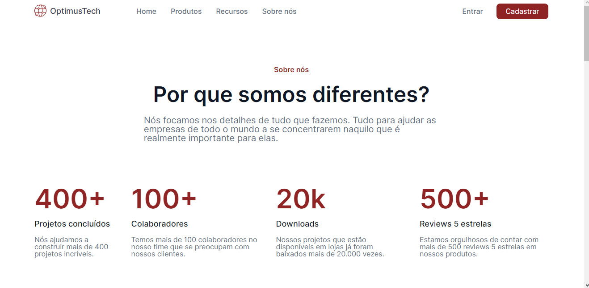
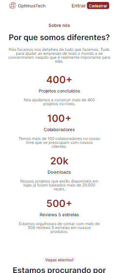
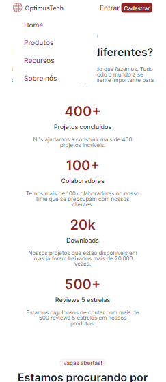

# OptimusTech

Seja bem vindo ao projeto feito através do desafio #7DaysOfCode proporcionado pela Alura!

Nele está uma página destinada a novas contratações da empresa OptimusTech

## Ferramentas utilizadas:

* HTML

* CSS

### Responsivo para o celular:

## Feito por:

### Maria Luíza, com o auxílio da Gi Moeller do Girl Coding, pelo desafio #7DaysOfCode da Alura.

### Linkedin: https://www.linkedin.com/in/lizmariasena/
